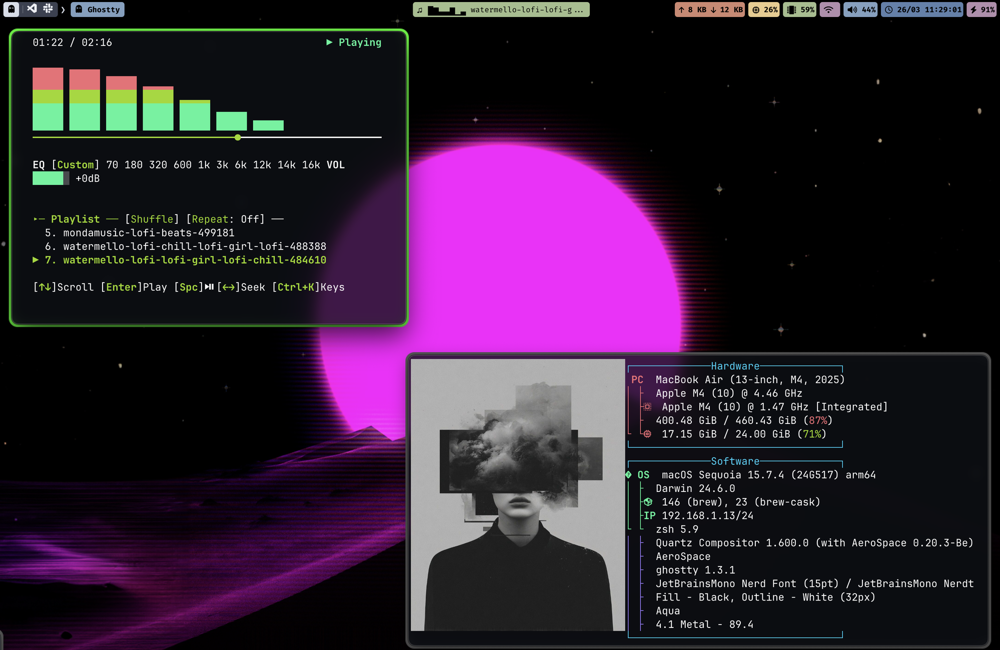

# dotfiles

My macOS rice setup featuring AeroSpace tiling WM, SketchyBar, Ghostty, and more.



## Stack

| Tool | Purpose |
|------|---------|
| [AeroSpace](https://github.com/nikitabobko/AeroSpace) | Tiling window manager |
| [SketchyBar](https://github.com/FelixKratz/SketchyBar) | Custom menu bar with workspace indicators and media widget |
| [JankyBorders](https://github.com/FelixKratz/JankyBorders) | Active/inactive window borders |
| [Ghostty](https://ghostty.org/) | Terminal emulator |
| [cmux](https://cmux.com/) | Ghostty-based terminal with vertical tabs for AI coding agents |
| [Fastfetch](https://github.com/fastfetch-cli/fastfetch) | System info display with custom image |
| [media-control](https://github.com/aspect-build/media-control) | macOS Now Playing integration |
| [cliamp](https://github.com/bjarneo/cliamp) | CLI music player |

## Install Dependencies

```bash
# Add taps
brew tap nikitabobko/tap
brew tap felixkratz/formulae
brew tap bjarneo/cliamp

# Formulae
brew install nikitabobko/tap/aerospace
brew install felixkratz/formulae/sketchybar
brew install felixkratz/formulae/borders
brew install fastfetch
brew install imagemagick
brew install media-control
brew install jq
brew install bjarneo/cliamp/cliamp

# Casks
brew install --cask ghostty
brew install --cask cmux
brew install --cask font-sketchybar-app-font
brew install --cask font-jetbrains-mono-nerd-font
```

Or install everything at once:

```bash
brew tap nikitabobko/tap && brew tap felixkratz/formulae && brew tap bjarneo/cliamp

brew install nikitabobko/tap/aerospace felixkratz/formulae/sketchybar felixkratz/formulae/borders fastfetch imagemagick media-control jq bjarneo/cliamp/cliamp && \
brew install --cask ghostty cmux font-sketchybar-app-font font-jetbrains-mono-nerd-font
```

## Setup

Copy configs to their expected locations:

```bash
# AeroSpace
cp dotfiles/.aerospace.toml ~/.aerospace.toml

# SketchyBar
cp -r dotfiles/sketchybar ~/.config/sketchybar

# Ghostty
cp dotfiles/ghostty/config ~/.config/ghostty/config

# Fastfetch
cp -r dotfiles/fastfetch ~/.config/fastfetch

# Floorp / Firefox CSS
cp dotfiles/firefox/userChrome.css ~/Library/Application\ Support/Floorp/Profiles/<your-profile>/chrome/userChrome.css

# Rice scripts
cp scripts/rice-*.sh /usr/local/bin/  # or anywhere in your $PATH
```

## Rice Scripts

```bash
# Start everything (AeroSpace + SketchyBar + JankyBorders + media widget)
./scripts/rice-restart.sh

# Stop everything
./scripts/rice-stop.sh

# Check status
./scripts/rice-status.sh
```

## Config Locations

| Config | Path |
|--------|------|
| AeroSpace | `~/.aerospace.toml` |
| SketchyBar | `~/.config/sketchybar/` |
| Ghostty | `~/.config/ghostty/config` |
| Fastfetch | `~/.config/fastfetch/config.jsonc` |
| Floorp CSS | `~/Library/Application Support/Floorp/Profiles/<profile>/chrome/userChrome.css` |
